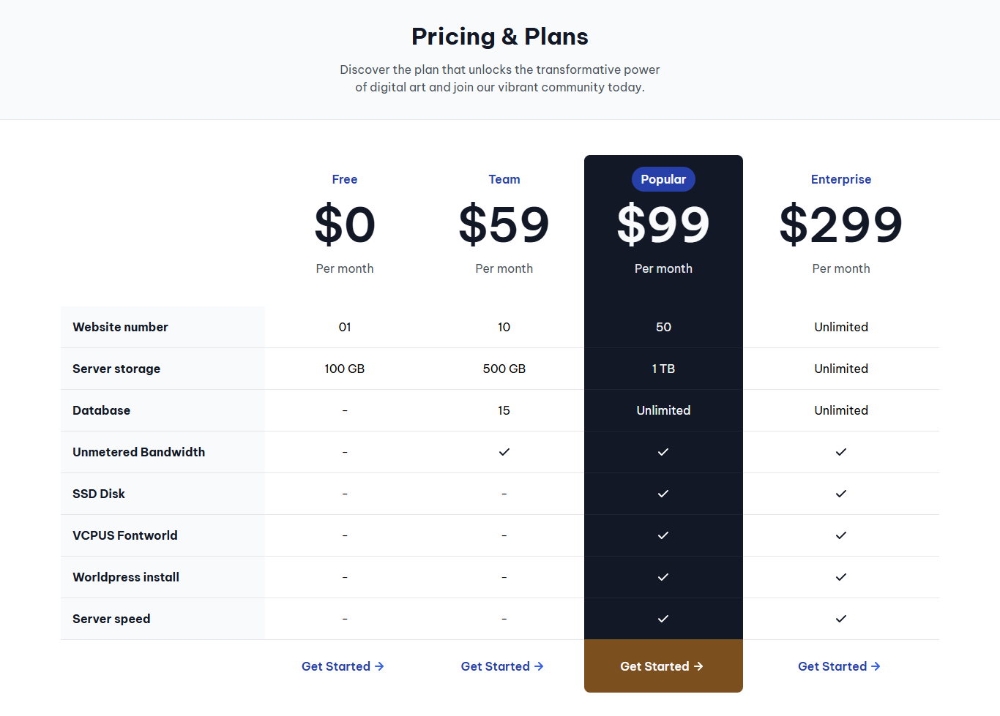

<!-- Please update value in the {}  -->

<h1 align="center">Pricing Table Component | devChallenges</h1>

   Solution for a challenge <a href="https://devchallenges.io/challenge/pricing-table-section-challenge" target="_blank">Pricing Table</a> from <a href="http://devchallenges.io" target="_blank">devChallenges.io</a>.

  <h3>
    <a href="https://gustavo2023.github.io/pricing-table-component/">
      Demo
    </a>
     | 
    <a href="https://devchallenges.io/solution/43515">
      Solution
    </a>
     | 
    <a href="https://devchallenges.io/challenge/pricing-table-section-challenge">
      Challenge
    </a>
  </h3>

<!-- TABLE OF CONTENTS -->

## Table of Contents

- [Overview](#overview)
  - [What I learned](#what-i-learned)
  - [Useful resources](#useful-resources)
- [Built with](#built-with)
- [Features](#features)
- [Contact](#contact)
- [Acknowledgements](#acknowledgements)

<!-- OVERVIEW -->

## Overview

This project is a responsive pricing table component designed to display different pricing plans and their respective features. The table includes four pricing plans: Free, Team, Popular, and Enterprise. Each plan is presented with its name, price per month, and a list of features available under that plan.

### What I learned

- Using semantic HTML elements like `table`, `thead`, `tbody`, `th`, and `td` helps in creating a well-structured and accessible table.
- Learned to use various CSS selectors to target specific elements within the table:
-`nth-child` selector to target specific columns.
-`last-child` selector to style the last row of the table.
- Combining selectors to apply styles to specific elements, such as table `tr:last-child td:nth-child(4)` to target the last row of the fourth column.

### Built with

- Semantic HTML5 markup
- CSS custom properties
- Flexbox

## Features

- **Responsive Design**: The table adjusts its layout based on the screen size, hiding the Free plan column on medium screens and truncating text with ellipsis on smaller screens.
- **Plan Details**: Each plan displays its name, price, and a list of features such as website number, server storage, database availability, unmetered bandwidth, SSD disk, VCPUS, WordPress install, and server speed.
- **Visual Indicators**: Checkmarks are used to indicate the availability of features in each plan.
- **Call to Action**: Each plan includes a "Get Started" button with an arrow icon, encouraging users to take action.

## Author

- GitHub [@gustavo2023](https://github.com/gustavo2023)
